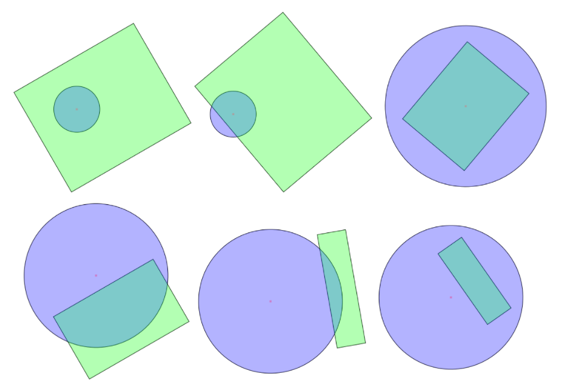

Followed the amazing youtube tutorial:
https://youtu.be/ftDxniRTpRQ

commands used:

1. npx create-react-app breakoutvideo --template typescript
2. npm i react-router-dom

-> There are only two cases when the circle intersects with the rectangle:

Either the circle's centre lies inside the rectangle, or
 
One of the edges of the rectangle has a point in the circle.
 

